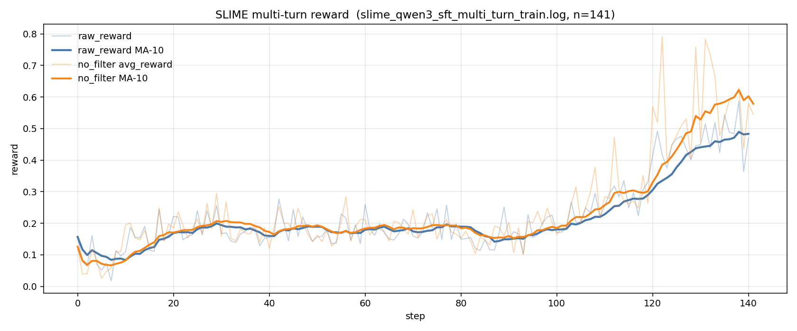

# TritonForge-Slime-6gpu

Fork of [RLsys-Foundation/TritonForge](https://github.com/RLsys-Foundation/TritonForge)  
(upstream SLIME based on [THUDM/slime](https://github.com/THUDM/slime)).

Same RL recipe as upstream. This fork is for running it when you do not have enough GPUs.

---

## Overview

Upstream wants train, rollout, and eval on **separate GPUs at the same time** (roughly an 8-GPU setup). We only had **6 usable GPUs**, and did not want to shrink batch / length / TP just to fit.

Looking at the run, **eval was the bottleneck**, but eval GPUs were often near **0% utilization** (compile on CPU, waiting, one kernel on one card). Train GPUs were also idle while waiting for scores. Wasting cards, not “training too heavy.”

**Our idea is simple:**

1. **Put Megatron training to sleep** (offload) during generate + eval.  
2. **Turn off async overlap** — do not train and eval on the same cards at the same time. Use a sync loop: score first, then train.  
3. While train is asleep, **let eval use those train GPUs** (borrow).  
4. Keep a **small reserved eval GPU** that always belongs to eval, so scoring can continue even when train is awake, and as a fallback when borrow OOMs.

So: sleep train → free its cards → eval borrows them → clear borrow → wake train. That is the whole point of this fork.

**Reserved vs borrow (short):**

- **Reserved** — always for eval (small, e.g. 1 GPU).  
- **Borrowable** — train GPUs, only while train is sleeping.  

Borrow can **OOM** (large kernels / tight memory after offload). Then the job is **requeued to reserved with higher priority (jump the queue)**. If reserved also OOMs, the sample fails.

Rollout (SGLang) stays on its own GPU so the policy stays loaded for generation.

---

## Example layout (6 GPUs)

| Role | GPUs |
|------|------|
| Left alone | `0,1` |
| Train (sleep → borrowable) | `2,3,4,5` |
| Rollout | `6` |
| Eval reserved | `7` |

```text
generate + eval   : reserved + borrowable (train asleep)
clear borrow      : kill eval on train GPUs, free VRAM
Megatron train    : borrowable locked; reserved still eval-only
```

---

## Control loop

```text
generate → borrow enable (train asleep, eval uses reserved + borrow)
pause rollout
borrow disable → immediate kill + VRAM back to baseline
wake + train
borrow enable again
```

### Extra fixes we needed

| Issue | Fix |
|-------|-----|
| Borrow OOM / huge shapes | Requeue to reserved with priority jump |
| Eval process still holds VRAM | Kill on disable + wait for baseline |
| NCCL crash after wake | NCCL prewarm |
| Train starts too early | Pause file + borrow gate |
| Cold / resume | `lib_train_mode.sh` |

We did not change KernelBench rewards or GRPO math.

---

## Results

We successfully ran **Qwen3-8B KernelBook-SFT → multi-turn RL** on this 6-GPU borrow layout (cold start from SFT). Wall time is **about one day** for ~140 steps on our machine (most of that is generate + KernelBench eval while train is asleep; Megatron steps are a smaller fraction).

Training metric: mean `rollout/raw_reward` per step (same signal upstream blogs use).

| Window | Steps | Mean `raw_reward` |
|--------|-------|-------------------|
| Early | 0–9 | ~0.09 |
| Mid | 50–59 | ~0.17 |
| Later | 100–109 | ~0.22 |
| Latest 10 | 131–140 | ~0.48 |

At **step 140**: last step ≈ **0.47**, 10-step moving average ≈ **0.48**, peak step ≈ **0.59** (step 138). Still climbing; not a finished plateau.

<p align="center">
  
</p>

This is a **train-time reward curve**, not a held-out KernelBench Pass@1 table.

---

## How to run

```bash
bash SLIME/scripts/run_agent_kbench_qwen3_8B_sft_nv_multi_turn.sh
bash SLIME/scripts/run_agent_kbench_qwen3_8B_sft_nv_single_turn.sh
TRAIN_MODE=resume bash SLIME/scripts/run_agent_kbench_qwen3_8B_sft_nv_multi_turn.sh
```

Env: `PROJECT_ROOT`, `TF_LOG_DIR`, `TRAIN_MODE`, `EVAL_RESERVED_DEVICES`, `EVAL_BORROWABLE_DEVICES`.

Code: `SLIME/train.py`, `SLIME/slime/ray/ppo_actor.py`, `KBenchEval/scripts/eval_server_subprocess.py`.

Setup / models: [upstream TritonForge](https://github.com/RLsys-Foundation/TritonForge).

---

## Not in git

`models/`, logs, `rollout_data/`, wandb, `.venv` (weights are 100GB+).

---

## Lineage

```text
THUDM/slime → RLsys-Foundation/TritonForge → i3wanna2/TritonForge-Slime-6gpu
```

Apache-2.0.

---

## Monitoring

Prefer **`rollout/raw_reward`** over `train/loss` (GRPO advantages ≈ 0 by design).
